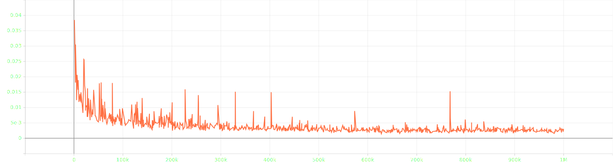
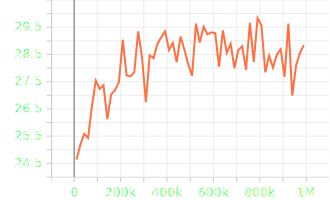

# mipnerf_pl
Unofficial pytorch-lightning implement of Mip-NeRF
I am training my modified code, I will update the README if the code works well.

I have finished some experiment, but I can not reach the result as
the paper, update it firstly, I will keep trying to find out what's
the matter.

Training loss

Training psnr

Val psnr

# Acknowledgements
Thansks to [mipnerf-pytorch](https://github.com/AlphaPlusTT/mipnerf-pytorch) and [nerf_pl](https://github.com/kwea123/nerf_pl)
