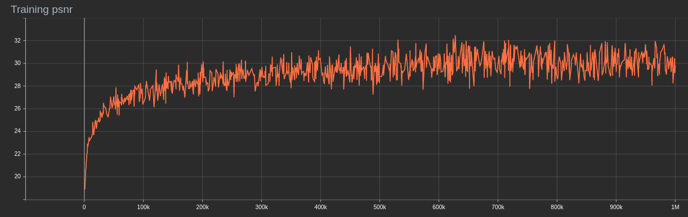
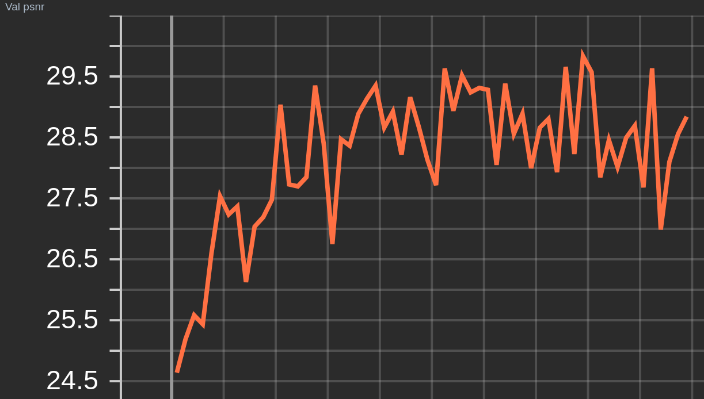
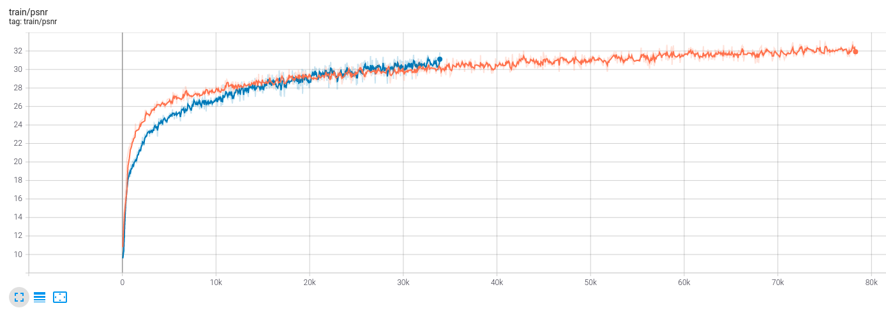
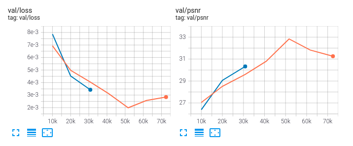

# mipnerf_pl
Unofficial pytorch-lightning implement of Mip-NeRF
I am training my modified code, I will update the README if the code works well.

Update: I have added single scale training. I train single in my computer for about 
80k step in *chair* data  and 35k in *lego* data, the trend of convergence is the same,
and it will keep go up.
I have to stop because I can't do anything when training in my computer :sob:.

Training multi scale psnr

Val multi scale psnr

Training single scale psnr

Val single scale psnr

# Acknowledgements
Thansks to [mipnerf-pytorch](https://github.com/AlphaPlusTT/mipnerf-pytorch) and [nerf_pl](https://github.com/kwea123/nerf_pl)
