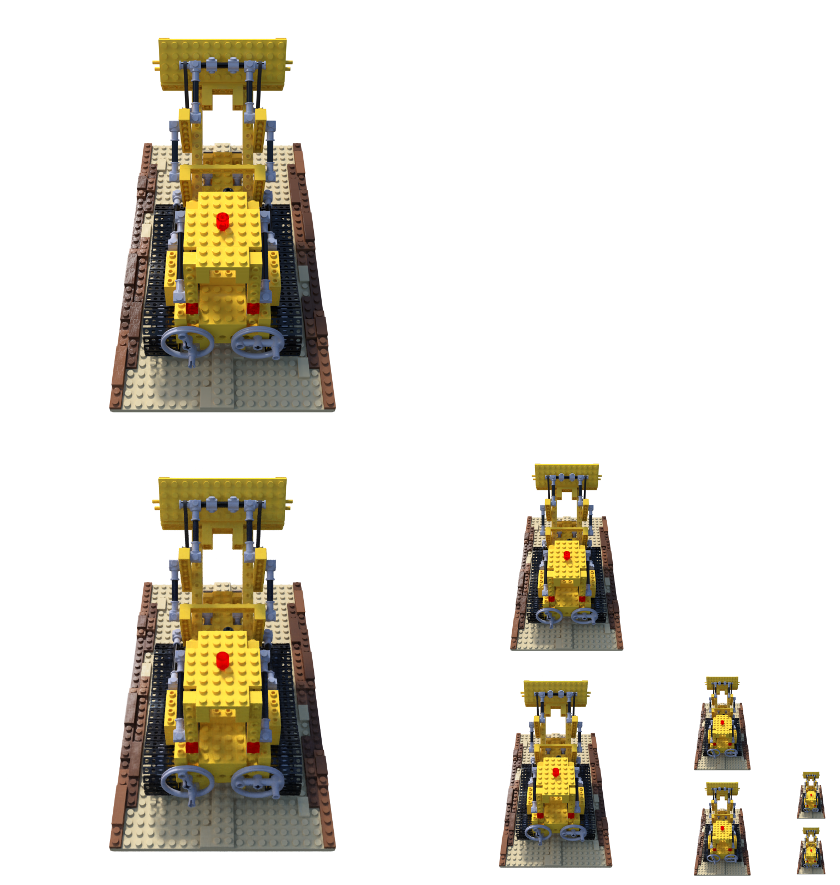
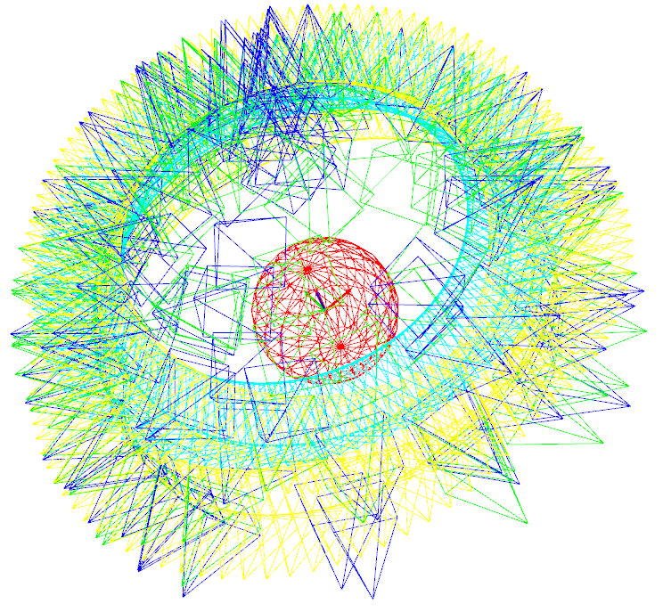
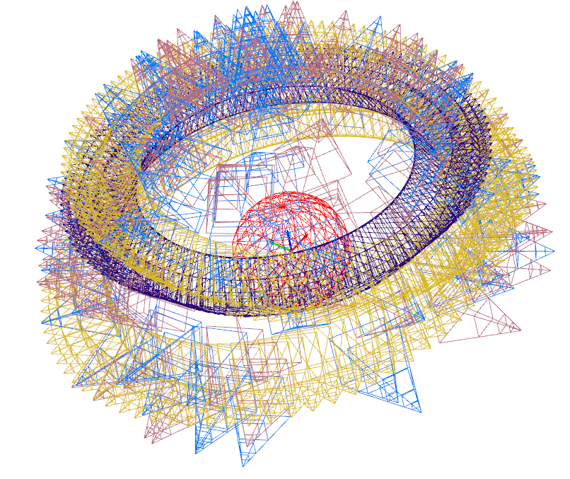

# mipnerf_pl
Unofficial pytorch-lightning implement of [Mip-NeRF](https://jonbarron.info/mipnerf/), Here are some results generated by this repository (pre-trained models are provided below):

[](https://youtu.be/3MxfZVUOIps "Multi-scale render result")

<table class="tg">
<thead>
  <tr>
    <th class="tg-0lax"></th>
    <th class="tg-baqh" colspan="12">Multi Scale Train And Multi Scale Test</th>
    <th class="tg-0lax" colspan="2">Single Scale</th>
  </tr>
</thead>
<tbody>
  <tr>
    <td class="tg-0pky"></td>
    <td class="tg-c3ow" colspan="6"><span style="font-weight:400;font-style:normal">PNSR</span></td>
    <td class="tg-c3ow" colspan="6"><span style="font-weight:400;font-style:normal">SSIM</span></td>
    <td class="tg-0lax">PSNR</td>
    <td class="tg-0lax">SSIM</td>
  </tr>
  <tr>
    <td class="tg-0pky"></td>
    <td class="tg-c3ow">Full Res</td>
    <td class="tg-c3ow">1/2 Res</td>
    <td class="tg-c3ow">1/4 Res</td>
    <td class="tg-c3ow">1/8 Res</td>
    <td class="tg-c3ow">Aveage <br>(PyTorch)</td>
    <td class="tg-c3ow">Aveage <br>(Jax)</td>
    <td class="tg-0pky">Full Res</td>
    <td class="tg-0pky"><span style="font-weight:400;font-style:normal">1/2 Res</span></td>
    <td class="tg-0pky"><span style="font-weight:400;font-style:normal">1/4 Res</span></td>
    <td class="tg-0pky"><span style="font-weight:400;font-style:normal">1/8 Res</span></td>
    <td class="tg-c3ow"><span style="font-weight:400;font-style:normal">Average</span><br><span style="font-weight:400;font-style:normal">(PyTorch)</span></td>
    <td class="tg-c3ow"><span style="font-weight:400;font-style:normal">Average</span><br><span style="font-weight:400;font-style:normal">(Jax)</span></td>
    <td class="tg-baqh" colspan="2">Full Res</td>
  </tr>
  <tr>
    <td class="tg-0pky">lego</td>
    <td class="tg-c3ow"><span style="font-weight:400;font-style:normal">34.412</span></td>
    <td class="tg-c3ow"><span style="font-weight:400;font-style:normal">35.640</span></td>
    <td class="tg-c3ow"><span style="font-weight:400;font-style:normal">36.074</span></td>
    <td class="tg-c3ow"><span style="font-weight:400;font-style:normal">35.482</span></td>
    <td class="tg-c3ow"><span style="font-weight:400;font-style:normal">35.402</span></td>
    <td class="tg-c3ow"><span style="font-weight:bold">35.736</span></td>
    <td class="tg-c3ow"><span style="font-weight:400;font-style:normal">0.9719</span></td>
    <td class="tg-c3ow"><span style="font-weight:400;font-style:normal">0.9843</span></td>
    <td class="tg-c3ow"><span style="font-weight:400;font-style:normal">0.9897</span></td>
    <td class="tg-c3ow"><span style="font-weight:400;font-style:normal">0.9912</span></td>
    <td class="tg-c3ow"><span style="font-weight:bold">0.9843</span></td>
    <td class="tg-c3ow"><span style="font-weight:bold">0.9843</span></td>
    <td class="tg-0lax">35.198</td>
    <td class="tg-0lax"><span style="font-weight:400;font-style:normal">0.985</span></td>
  </tr>
</tbody>
</table>



The top image of each column is groundtruth and the bottom image is Mip-NeRF render in different resolutions.

The above results are trained on the `lego` dataset with 300k steps for single-scale and multi-scale datasets respectively, and the pre-trained model can be found [here](https://drive.google.com/drive/folders/1QWhWkI37JDQRTcRjx6JfpUhjfKl_v8Rr?usp=sharing).
Feel free to contribute more datasets.

## Installation
We recommend using [Anaconda](https://www.anaconda.com/products/individual) to set up the environment. Run the following commands:
```
# Clone the repo
git clone https://github.com/hjxwhy/mipnerf_pl.git; cd mipnerf_pl
# Create a conda environment
conda create --name mipnerf python=3.9.12; conda activate mipnerf
# Prepare pip
conda install pip; pip install --upgrade pip
# Install PyTorch
pip3 install torch torchvision --extra-index-url https://download.pytorch.org/whl/cu113
# Install requirements
pip install -r requirements.txt
```
## Dataset
Download the datasets from the [NeRF official Google Drive](https://drive.google.com/drive/folders/128yBriW1IG_3NJ5Rp7APSTZsJqdJdfc1) and unzip `nerf_synthetic.zip`. You can generate the multi-scale dataset used in the paper with the following command:

```
# Generate all scenes
python datasets/convert_blender_data.py --blender_dir UZIP_DATA_DIR --out_dir OUT_DATA_DIR
# If you only want to generate a scene, you can:
python datasets/convert_blender_data.py --blender_dir UZIP_DATA_DIR --out_dir OUT_DATA_DIR --object_name lego
```
## Running
### Train
To train a single-scale `lego` Mip-NeRF:
```
# You can specify the GPU numbers and batch size at the end of command,
# such as num_gpus 2 train.batch_size 4096 val.batch_size 8192 and so on.
# More parameters can be found in the configs/lego.yaml file. 
python train.py --out_dir OUT_DIR --data_path UZIP_DATA_DIR --dataset_name blender exp_name EXP_NAME
```
To train a multi-scale `lego` Mip-NeRF:

```
python train.py --out_dir OUT_DIR --data_path OUT_DATA_DIR --dataset_name multi_blender exp_name EXP_NAME
```

### Evaluation

You can evaluate both single-scale and multi-scale models under the `eval.sh` guidance, changing all directories to your directory. Alternatively, you can use the following command for evaluation.

```
# eval single scale model
python eval.py --ckpt CKPT_PATH --out_dir OUT_DIR --scale 1 --save_image
# eval multi scale model
python eval.py --ckpt CKPT_PATH --out_dir OUT_DIR --scale 4 --save_image
# summarize the result again if you have saved the pnsr.txt and ssim.txt
python eval.py --ckpt CKPT_PATH --out_dir OUT_DIR --scale 4 --summa_only
```

### Render Spheric Path Video
It also provide a script for rendering spheric path video
```
# Render spheric video
python render_video.py --ckpt CKPT_PATH --out_dir OUT_DIR --scale 4
# generate video if you already have images
python render_video.py --gen_video_only --render_images_dir IMG_DIR_RENDER
```

### Visualize All Poses

The script modified from [nerfplusplus](https://github.com/Kai-46/nerfplusplus) supports visualize all poses which have been reorganized to right-down-forward coordinate. Multi-scale have different camera focal length which is equivalent to different resolutions.





## Citation
Kudos to the authors for their amazing results:

```
@misc{barron2021mipnerf,
      title={Mip-NeRF: A Multiscale Representation for Anti-Aliasing Neural Radiance Fields},
      author={Jonathan T. Barron and Ben Mildenhall and Matthew Tancik and Peter Hedman and Ricardo Martin-Brualla and Pratul P. Srinivasan},
      year={2021},
      eprint={2103.13415},
      archivePrefix={arXiv},
      primaryClass={cs.CV}
}
```


# Acknowledgements
Thansks to [mipnerf](https://github.com/google/mipnerf),
[mipnerf-pytorch](https://github.com/AlphaPlusTT/mipnerf-pytorch),
[nerfplusplus](https://github.com/Kai-46/nerfplusplus),
[nerf_pl](https://github.com/kwea123/nerf_pl)
